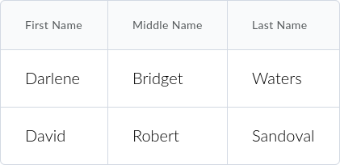
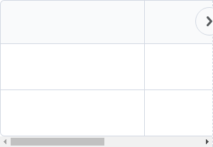
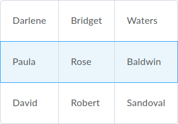
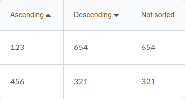

**Looking for SASS-based `d2l-table`?** It's [over here](https://github.com/BrightspaceUI/table/tree/sass).

# d2l-table
[![Bower version][bower-image]][bower-url]
[![Build status][ci-image]][ci-url]
[![Dependency Status][dependencies-image]][dependencies-url]

Tables are styled like this:

A [Polymer](https://www.polymer-project.org/1.0/)-based web component for D2L tables, which includes styling for tables.





For further information on this and other Brightspace UI components, see the docs at [ui.developers.brightspace.com](http://ui.developers.brightspace.com/).

## Installation

`d2l-table` can be installed from [Bower][bower-url]:
```shell
bower install d2l-table
```

## Usage

Include the [webcomponents.js](http://webcomponents.org/polyfills/) "lite" polyfill (for browsers who don't natively support web components), then import `d2l-table.html`:

```html
<head>
	<script src="https://s.brightspace.com/lib/webcomponentsjs/0.7.21/webcomponents-lite.min.js"></script>
	<link rel="import" href="../d2l-table/d2l-table.html">
</head>
```

HTML:
```html
<table is="d2l-table">
	<thead>
		<tr>
			<th>Header column 1</th>
			<th>Header column 2</th>
		</tr>
	</thead>
	<tbody>
		<tr>
			<td>row 1 column 1</td>
			<td>row 1 column 2</td>
		</tr>
		<tr>
			<td>row 2 column 1</td>
			<td>row 2 column 2</td>
		</tr>
	</tbody>
</table>
```

#### Row Styles



HTML:
```html
<table is="d2l-table">
	<tr selected>
		<td>selected</td>
	</tr>
	<tr active>
		<td>active</td>
	</tr>
	<tr active selected>
		<td>active and selected</td>
	</tr>
</table>
```

#### Header Icons



HTML:
```html
<table is="d2l-table">
	<thead>
		<th>
			<button is="d2l-table-col-sort-button">Ascending</button>
		</th>
		<th>
			<button is="d2l-table-col-sort-button" desc>Descending</button>
		</th>
	</thead>
	<tbody>
	<tr>
		<td>123</td>
		<td>321</td>
	</tr>
	<tr>
		<td>456</td>
		<td>654</td>
	</tr>
	</tbody>
</table>
```

### Usage in Production

In production, it's recommended to use a build tool like [Vulcanize](https://github.com/Polymer/vulcanize) to combine all your web components into a single import file. [More from the Polymer Docs: Optimize for Production](https://www.polymer-project.org/1.0/tools/optimize-for-production.html)...

```shell
vulcanize --inline-scripts index.html
```

## Tests

Run

```shell
npm test
```

To run tests. The following tests are run:

* **lint:js** Runs eslint for Javascript in and out of HTML
* **lint:wc** Runs Polymer's linter
* **galen**   Runs Galen tests. See [Galen](#galen)
* **wct**     Runs WCT tests. Tests functionality of table

### Galen

The [Galen][Galen] tests check layout and look of table. Galen is not meant to test functionality. For example, these tests will fail if the border-radius changes. The tests use a combination of screenshots and layout assertions. The results of the tests can be found in *reports/d2l-table/report.html*

To update the screenshots, run `npm run dump`. The screenshots will be placed under *dumps/d2l-table/objects*

* run the tests with `npm run test:galen`
* [galen.config](galen.config) can be used to change the browser that is being tested. See the [config documentation][GalenConfig]
* [table.gspec](table.gspec) contains the actual assertions. Documentation can be found [here][GalenSpec]

## Coding styles

See the [Best Practices & Style Guide](https://github.com/Brightspace/valence-ui-docs/wiki/Best-Practices-&-Style-Guide) for information on naming conventions, plus information about the [EditorConfig](http://editorconfig.org) rules used in this repo.

[bower-url]: http://bower.io/search/?q=d2l-table
[bower-image]: https://img.shields.io/bower/v/d2l-table.svg
[ci-url]: https://travis-ci.org/BrightspaceUI/table
[ci-image]: https://img.shields.io/travis-ci/BrightspaceUI/table.svg
[dependencies-url]: https://david-dm.org/BrightspaceUI/table
[dependencies-image]: https://img.shields.io/david/BrightspaceUI/table.svg
[Galen]: http://galenframework.com/
[GalenConfig]: http://galenframework.com/docs/getting-started-configuration/
[GalenSpec]: http://galenframework.com/docs/reference-galen-spec-language-guide/
